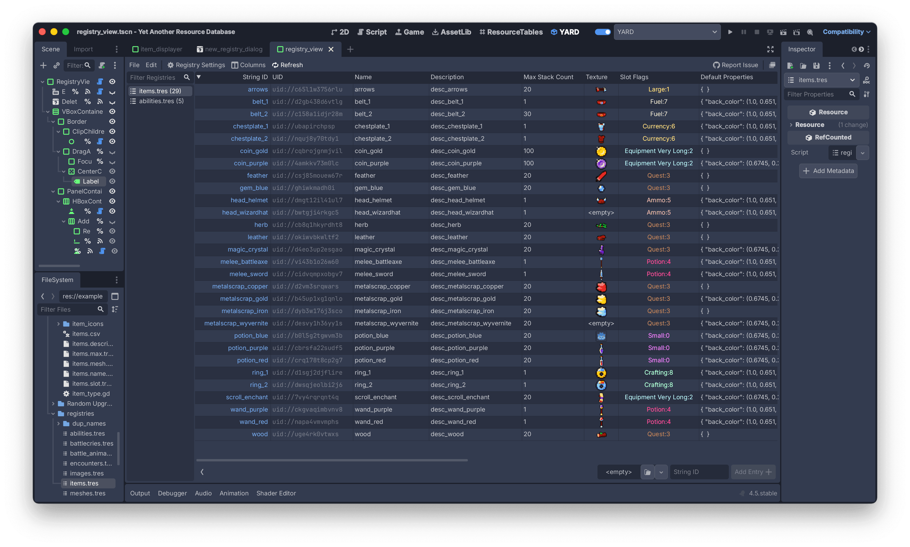

# YARD — Yet Another Resource Database

A Godot 4 plugin for managing and querying collections of resources through a dedicated editor interface and runtime API.

## Overview



YARD has two complementary aspects:

**A table-based resource editor.** The YARD editor tab lets you create and manage registries: catalogues of resources grouped by class. Each registry provides a spreadsheet-like view of your resources and their properties.

**A lightweight runtime API.** At runtime, a `Registry` is just a small `.tres` file holding UIDs and string IDs. It does not load the resources it references. _You_ control when loading happens, and how.

## Features

- 🏷 Reference resources by stable, human-readable string IDs instead of file paths or UIDs lying around in some autoload
- 🔒 Restrict a registry to a specific class — only matching resources can be added
- 🔄 Sync a registry from a directory — entries are added and removed automatically as resource files appear or disappear, recursively or not
- 🥧 Bake a property index in the editor for zero-cost runtime queries by resource property values
- 📦 Load entries individually, all at once (blocking), or asynchronously via threaded loading
- ⚡ No runtime overhead beyond what you explicitly request, all expensive operations happen in the editor

## Installation

1. Copy the `addons/yard` folder into your project's `addons/` directory
2. Enable the plugin in **Project > Project Settings > Plugins**

## Usage

### Creating a registry

Open the **YARD** tab in the editor, click **New Registry**, and configure:

- **Class restriction** — only resources of this class (or subclasses) will be accepted
- **Scan directory** — the registry will stay in sync with resource files in this folder
- **Indexed properties** — property names to bake into the index for runtime filtering

### Loading an entry

```gdscript
const ENEMIES: Registry = preload("res://data/enemy_registry.tres")

func _on_fight_started() -> void:
    var skeleton: Enemy = ENEMIES.load_entry(&"skeleton")
```

### Loading all entries

```gdscript
# Blocking
var all_enemies := ENEMIES.load_all_blocking()

# Threaded
var tracker := ENEMIES.load_all_threaded_request()
```

### Querying the index

The property index is baked in the editor. Queries run at runtime without loading any resource.

```gdscript
# All entries where rarity == LEGENDARY
var legendaries := WEAPONS.filter_by_value(&"rarity", Rarity.LEGENDARY)

# All entries where level >= 10
var high_level := WEAPONS.filter_by(&"level", func(v): return v >= 10)

# AND query across multiple properties
var legendary_swords := WEAPONS.filter_by_values({
    &"rarity": Rarity.LEGENDARY,
    &"type": &"sword",
})
```

## API Reference

Full API documentation is available in the in-editor class reference.

### Lookup

| Method                     | Description                                                   |
| -------------------------- | ------------------------------------------------------------- |
| `has(id)`                  | Returns `true` if the string ID or UID exists in the registry |
| `has_string_id(string_id)` | Returns `true` if the string ID exists                        |
| `has_uid(uid)`             | Returns `true` if the UID exists                              |
| `get_uid(id)`              | Resolves a string ID or UID to its canonical UID              |
| `get_string_id(uid)`       | Returns the string ID for a given UID                         |
| `get_all_string_ids()`     | Returns all registered string IDs                             |
| `get_all_uids()`           | Returns all registered UIDs                                   |
| `size()`                   | Number of entries                                             |
| `is_empty()`               | Returns `true` if the registry has no entries                 |

### Loading

| Method                                      | Description                                                                 |
| ------------------------------------------- | --------------------------------------------------------------------------- |
| `load_entry(id, type_hint, cache_mode)`     | Loads and returns a single resource                                         |
| `load_all_blocking(type_hint, cache_mode)`  | Loads all entries synchronously, returns `Dictionary[StringName, Resource]` |
| `load_all_threaded_request(type_hint, ...)` | Requests threaded loading for all entries, returns a `RegistryLoadTracker`  |

### Filtering

Filtering methods require the relevant properties to have been indexed in the editor.

| Method                             | Description                                                           |
| ---------------------------------- | --------------------------------------------------------------------- |
| `is_property_indexed(property)`    | Returns `true` if the property has a baked index                      |
| `filter_by_value(property, value)` | Returns string IDs of entries where `property == value`               |
| `filter_by(property, predicate)`   | Returns string IDs of entries where `predicate.call(value)` is `true` |
| `filter_by_values(criteria)`       | Returns string IDs matching all criteria (AND logic)                  |

## How the property index work

When you specify indexed properties in the editor and trigger a rebuild, YARD loads every resource in the registry, reads the listed properties, and stores the results in a baked index inside the `.tres` file.

At runtime, `filter_by_value` and related methods query this index directly, no resource is loaded. Pure sorcery !

```
_property_index = {
    "rarity": {
        Rarity.LEGENDARY: { "excalibur": true, "mjolnir": true },
        Rarity.COMMON:    { "stick": true },
    }
}
```

## License

[MIT](LICENSE)
