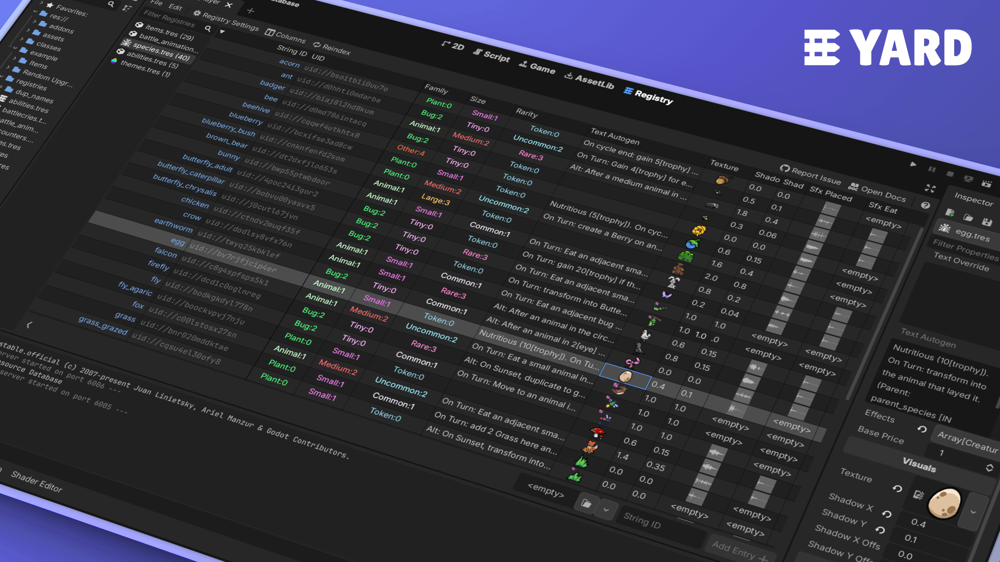

<h1 align="center">
  <picture>
	<source media="(prefers-color-scheme: dark)" srcset="addons/yard/editor_only/assets/yard_dark.svg">
	<source media="(prefers-color-scheme: light)" srcset="addons/yard/editor_only/assets/yard_light.svg">
	
  </picture>
  YARD — Yet Another Resource Database
</h1>

<p align="center">
  A Godot 4 plugin for managing and querying collections of resources, with a spreadsheet-like editor and a lightweight runtime API.
</p>

<p align="center">
  <a href="https://godotengine.org/download/" target="_blank" style="text-decoration:none"></a>
  <a href="https://github.com/elliotfontaine/yard-godot/releases"  target="_blank" style="text-decoration:none"></a>
</p>

## Overview

YARD builds on Godot's [resource system](https://docs.godotengine.org/en/4.4/tutorials/scripting/resources.html). It has two parts:

**A table-based resource editor.** The YARD editor tab lets you create and manage registries: catalogues of resources, optionally restricted to a class. Each registry provides a spreadsheet-like view of your resources and their properties.

**A lightweight runtime API.** At runtime, a `Registry` is just a small `.tres` file holding UIDs and string IDs. It contains only the mapping, never the resources themselves. _You_ control when loading happens, and how.

## Features

- 🏷 Stable string IDs that survive file moves, with no autoload boilerplate to maintain
- 🔒 Restrict a registry to a class so only matching resources can be added
- 🔄 Sync a registry from a directory (recursively or not), with entries staying in sync as files appear or disappear
- 🥧 Bake a property index in the editor for zero-cost runtime filtering by property value
- 📦 Load entries individually, all at once (blocking), or asynchronously via threaded loading
- ⚡ All expensive operations happen in the editor, leaving no runtime overhead beyond what you explicitly request

## Installation

1. Copy the `addons/yard` folder into your project's `addons/` directory
2. Enable the plugin in **Project > Project Settings > Plugins**

## Usage

### Creating a registry

Open the **Registry** tab in the editor, click **File > New Registry**, and configure:

- **Class restriction**: only resources of this class (or its subclasses) will be accepted
- **Scan directory**: the registry will stay in sync with resource files in this folder
- **Indexed properties**: property names to bake into the index for runtime filtering

### Adding entries

If a scan directory is set, entries are managed automatically. Otherwise, you can add entries manually in two ways:

- **Drag and drop** resources from the FileSystem dock into the registry table. They must match the class restriction.
- **Create a new resource on the spot** using the resource picker at the bottom of the table. When you press **Add Entry**, it creates and saves the file, then immediately registers it.

### Inspector dropdown with `@export_custom`

`Registry.PROPERTY_HINT_CUSTOM` enables a dropdown in the inspector for any `StringName`, `String`, `Array[StringName]`, or `Array[String]` property, populated with the string IDs of a given registry.

```gdscript
@export_custom(Registry.PROPERTY_HINT_CUSTOM, "res://data/item_registry.tres") var item: StringName
```

### Loading entries at runtime

```gdscript
const ENEMIES: Registry = preload("res://data/enemy_registry.tres")

# Load a single entry by string ID
var skeleton: Resource = ENEMIES.load_entry(&"skeleton")

# Load all entries at once (blocking)
var all_enemies: Dictionary[StringName, Resource] = ENEMIES.load_all_blocking()

# Load all entries via background threads
var tracker: RegistryLoadTracker = ENEMIES.load_all_threaded_request()
```

To look up the string ID of an already-loaded resource:

```gdscript
var string_id := ENEMIES.get_string_id_of(loaded_resource)
```

### Querying entries through the property index

Set up indexed properties in **Registry Settings** and press **Reindex** to bake the index. At runtime, queries run without loading any resource.

```gdscript
# Single property (exact value or predicate)
var legendaries := WEAPONS.filter(&"rarity", Rarity.LEGENDARY)
var high_level  := WEAPONS.filter(&"level", func(v): return v >= 10)

# AND query across multiple properties (exact values or predicates)
var forest_without_boss := ROOMS.where({
	&"biome": Biome.FOREST,
	&"tier": func(t): return t != RoomData.Tier.Boss,
})
```

Properties support dot notation for nested resources: `&"weapon.rarity"` resolves the `rarity` property of the subresource stored in `weapon`.

> The full `Registry` API is documented in the in-editor class reference: **Help > Search Help > Registry**.

## How the property index works its magic

The index is simply a nested dictionary stored inside the registry `.tres` file:

```gdscript
_property_index = {
	&"rarity": {
		Rarity.LEGENDARY: { &"excalibur": true, &"mjolnir": true },
		Rarity.COMMON: { &"stick": true },
	},
	&"level": {
		1: { &"stick": true },
		10: { &"excalibur": true },
		12: { &"mjolnir": true },
	}
}
```

## Contributing

Contributions are welcome. See [CONTRIBUTING.md](CONTRIBUTING.md) before opening a pull request.

For major changes, [open an issue](https://github.com/elliotfontaine/yard-godot/issues/new?template=feature_request.yml) first to discuss what you have in mind.

## License

[MIT](LICENSE)
